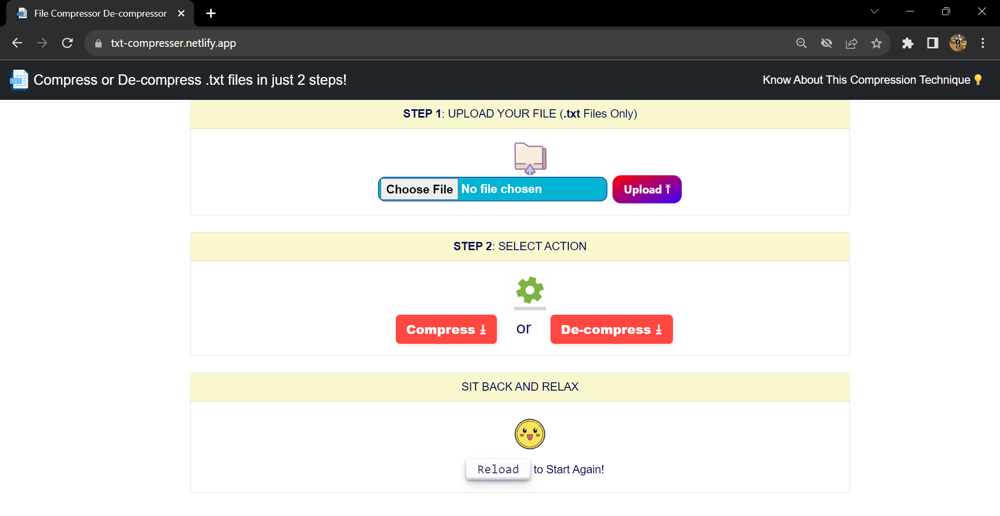
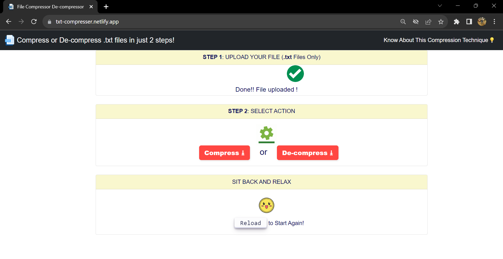
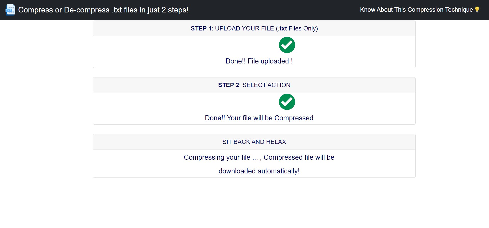
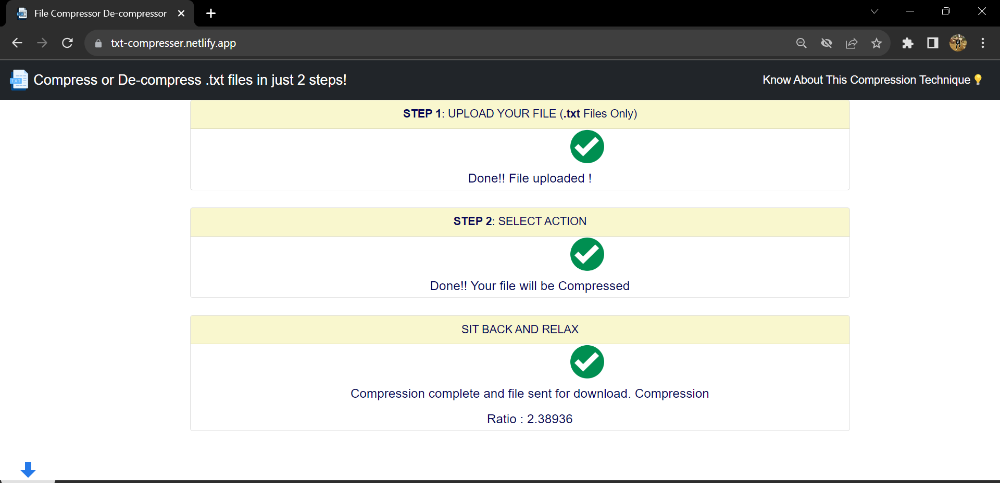
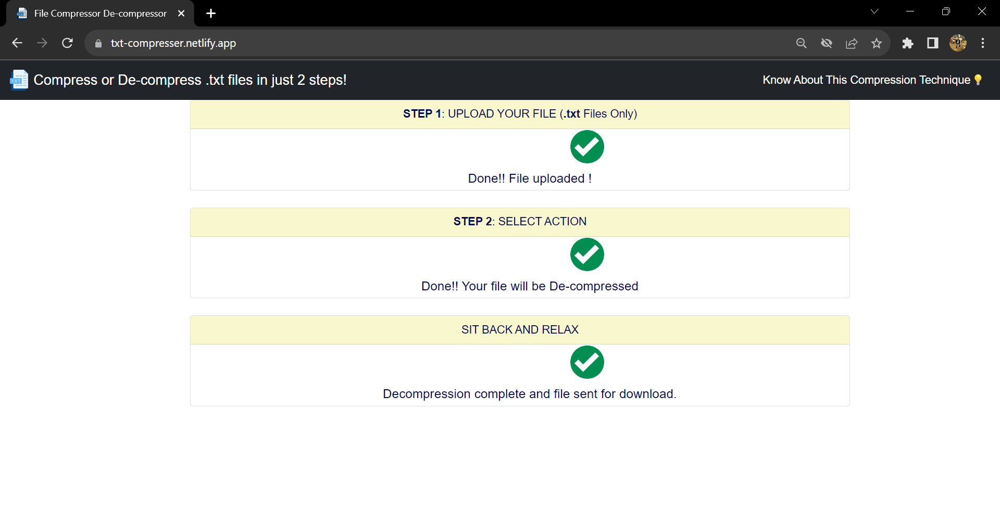
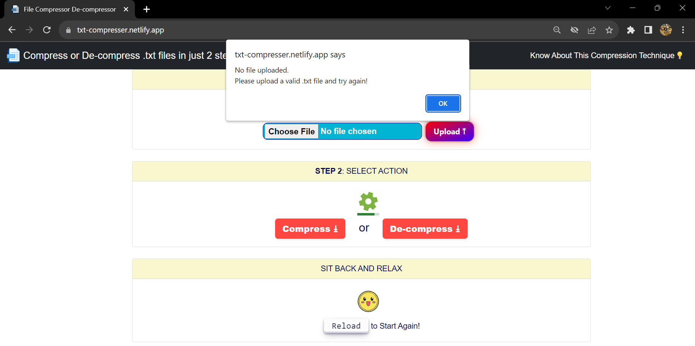

<h1> Text File Compressor De-compressor Web App</h1>

- This webapp uses Huffman Coding for Text Compression and De-compression.
- Made with JavaScript, HTML5 and CSS3.
- Live Demo:👇

- [x] [txt-compresser.app/](https://txt-compresser.netlify.app/)

## About this application:

* This website performs Lossless data compression and decompression of text(.txt) files using Huffman Algorithm.
* In this algorithm, a variable-length code is assigned to input different characters. The code length is related to how frequently characters are used. Most frequent characters have the smallest codes and longer codes for least frequent characters.
* A Huffman code is a tree, built bottom up, starting with the list of different characters appearing in a text and their frequency. 
* Compression ratio usually improves as the file size increases.
* The website is made responsive (with HTML and CSS ) and interactive (with JavaScript ) .
* An [Info page](https://txt-compresser.netlify.app/info.html) is added to give more information about tecnique of **Lossless Data Compression** with Huffman coding.

- [x] Landing Page:

- [x] Upload File

- [x] Select Action (Compress / De-compress)

- [x] Wait for File Download
    * File gets downloaded automatically when selected process is complete.

    * Compression - Compression Ratio is also displayed 

    
    
    * De-compression

    

* Additional Instructions and Warnings are provided if the above steps are not followed correctly

* About the tecnique of Lossless Data Compression with Huffman coding.

